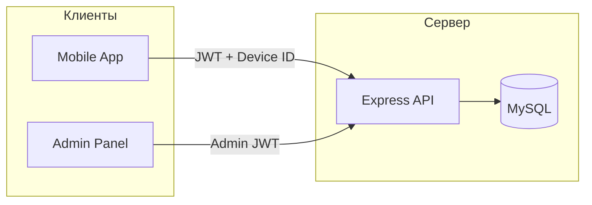
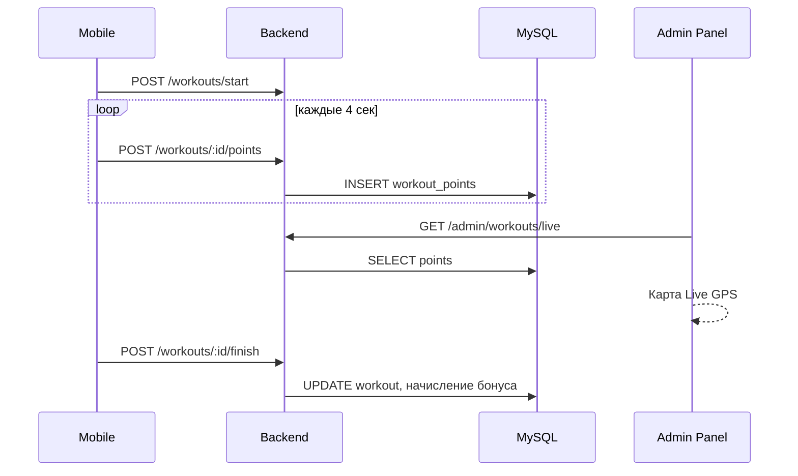

# Архитектура

## Обзор



## Репозиторий

| Папка | Стек | Порт (dev) |
|-------|------|------------|
| `backend/` | Node.js, Express, mysql2 | 3001 |
| `mobile/` | Ionic React, Vite, Capacitor 6 | 5173 |
| `admin/` | React, Vite | 5174 |
| `database/` | SQL schema + migrations | — |

## Backend

```
backend/src/
├── index.js           Точка входа, CORS, маршруты
├── config.js          Конфиг из .env
├── db.js              Пул MySQL
├── routes/            HTTP-маршруты
├── services/          Бизнес-логика
├── middleware/        authUser, authAdmin
└── utils/             geo, validation, helpers
```

### Основные сервисы

- `bonusService.js` — начисление/списание бонусов, кошелёк
- `workoutValidation.js` — проверка тренировки перед бонусом
- `summaryService.js` — экран «Сводка» в приложении
- `withdrawalService.js` — заявки на вывод
- `customerLevelService.js` — уровни клиентов по километражу
- `telegramService.js` — уведомления в Telegram

## Mobile

```
mobile/src/
├── pages/             Экраны (Home, Workout, Shop, …)
├── components/        UI-компоненты
├── services/          API, GPS, трекер тренировки
│   ├── workoutTracker.js   Сессия тренировки
│   ├── gpsFilter.js        Фильтрация GPS
│   ├── geolocation.js      Capacitor Geolocation
│   └── liveActivity.js     iOS Dynamic Island
└── plugins/           Нативные Capacitor-плагины
```

### Нативные возможности

| Платформа | Функция |
|-----------|---------|
| Android | Foreground Service, шагомер, SMS Retriever |
| iOS | Pedometer, Live Activity, WorkoutTracking plugin |

## Admin

SPA без роутера по URL — навигация через `activeTab` в `App.jsx`.

Разделы: Dashboard, клиенты, QR/кроссовки, тренировки (Live GPS), бонусные счета, магазин, склад, отчёты, реклама.

## Поток тренировки



## Авторизация

### Пользователь (mobile)

- Вход по SMS OTP: `POST /api/auth/sms/send` → `POST /api/auth/sms/login`
- JWT в `Authorization: Bearer <token>`
- Заголовок `X-Device-Id` — привязка устройства (один телефон на аккаунт)

### Администратор

- `POST /api/admin/login` → JWT с `adminId`
- Роли: `super_admin`, `manager`, `seller`

## CORS

Разрешены: `localhost`, `capacitor://`, произвольные origin для dev. В продакшене рекомендуется ограничить список доменов.
