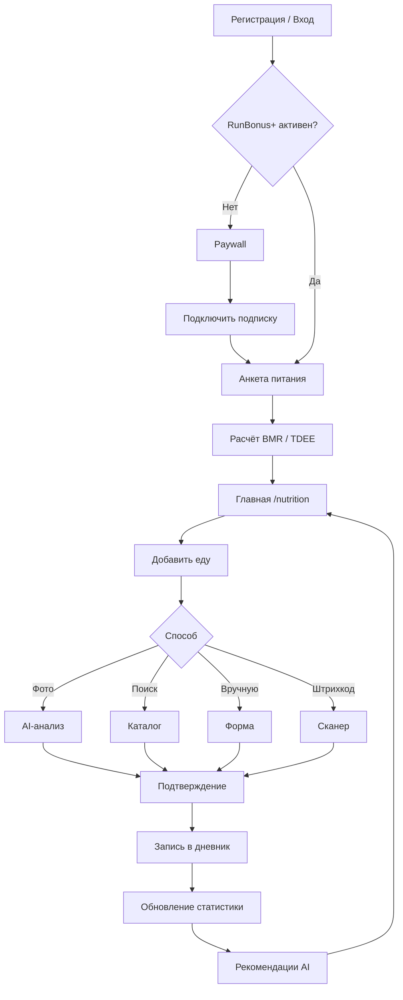
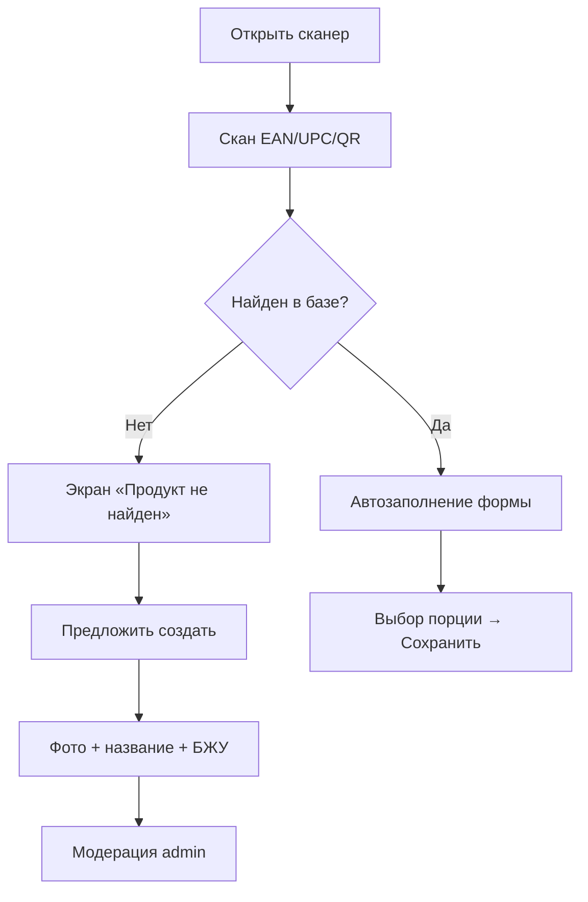
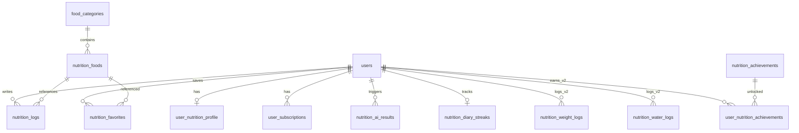

# RunBonus+ — Модуль «Питание и Калории»

**Версия документа:** 2.0  
**Дата:** 2026-07-03  
**Статус:** Единый источник требований (Product Specification)  
**Аудитория:** Product, Mobile, Backend, QA, Admin, DevOps

---

## Легенда статусов

| Маркер | Значение |
|--------|----------|
| ✅ **v1.0** | Реализовано в текущей версии |
| 🚧 **v1.1** | В разработке / частично |
| 📋 **v2.0** | Запланировано |
| 🔮 **v3.0** | Backlog / исследование |

**Связанные документы:**
- [Текущая реализация (v1.0)](NUTRITION.md)
- [API проекта](API.md)
- [Архитектура](ARCHITECTURE.md)
- [База данных](DATABASE.md)

---

# Содержание

1. [Общая информация](#1-общая-информация)
2. [User Flow](#2-user-flow)
3. [Экраны приложения](#3-экраны-приложения)
4. [Профиль питания](#4-профиль-питания)
5. [Формулы](#5-формулы)
6. [AI](#6-ai)
7. [Дневник питания](#7-дневник-питания)
8. [Каталог продуктов](#8-каталог-продуктов)
9. [Штрихкод](#9-штрихкод)
10. [AI Диетолог](#10-ai-диетолог)
11. [Вес](#11-вес)
12. [Вода](#12-вода)
13. [Бег (интеграция)](#13-бег-интеграция)
14. [Статистика](#14-статистика)
15. [Достижения](#15-достижения)
16. [Push-уведомления](#16-push-уведомления)
17. [API](#17-api)
18. [База данных](#18-база-данных)
19. [Админ-панель](#19-админ-панель)
20. [QA](#20-qa)
21. [Этапы внедрения](#21-этапы-внедрения)
22. [User Stories (каталог)](#22-user-stories-каталог)

---

# 1. Общая информация

## 1.1 Описание проекта

**RunBonus+ «Питание и Калории»** — premium-модуль мобильного приложения RunBonus, объединяющий GPS-трекинг пробежек с полноценным дневником питания, AI-распознаванием еды и персональными рекомендациями.

В отличие от классических calorie-tracker приложений, RunBonus+ **связывает расход калорий с реальными тренировками** пользователя в экосистеме RunBonus и мотивирует через бонусы, streak и достижения.

## 1.2 Цели

| # | Цель | KPI |
|---|------|-----|
| G1 | Удержание premium-подписчиков | Retention D30 ≥ 40% |
| G2 | Ежедневное использование дневника | DAU/MAU ≥ 35% |
| G3 | Точность AI-распознавания | Confidence ≥ 80% в 70% случаев |
| G4 | Конверсия free → RunBonus+ | ≥ 8% от MAU |
| G5 | Связь питания и бега | ≥ 60% пользователей видят «+ккал после пробежки» |

## 1.3 Назначение

- Контроль калорий и БЖУ
- Осознанное питание с учётом физической активности
- AI-помощник для быстрого ввода еды
- Аналитика прогресса (вес, баланс, streak)
- Монетизация через подписку RunBonus+

## 1.4 Основные возможности

| Возможность | v1.0 | v2.0 |
|-------------|------|------|
| Дневной баланс (съедено / сожжено / цель) | ✅ | ✅ |
| AI-фото еды | ✅ | ✅ + Gemini |
| Поиск по базе продуктов | ✅ (~25 seed) | 📋 100 000+ |
| Ручной ввод | ✅ | ✅ |
| Избранное | ✅ | ✅ |
| Штрихкод | — | 📋 |
| БЖУ и прогресс-бары | ✅ | ✅ |
| График недели | ✅ | 📋 расширенная статистика |
| AI-рекомендации | ✅ базовые | 📋 полный AI-диетолог |
| Streak дневника | ✅ | ✅ + бонусы |
| Push-уведомления | ✅ | 📋 расширенный набор |
| Вода | — | 📋 |
| История веса | — | 📋 |
| Достижения | — | 📋 100+ |
| Premium paywall | ✅ | ✅ + IAP |

## 1.5 Конкуренты

| Конкурент | Сильные стороны | Слабые стороны |
|-----------|-----------------|----------------|
| **MyFitnessPal** | Огромная база продуктов, штрихкоды | Нет связи с локальным бегом, платная подписка дорогая |
| **YAZIO** | Красивый UI, fasting | Слабая локализация TJ/UZ/RU кухни |
| **FatSecret** | Бесплатный базовый функционал | Устаревший UX |
| **Lifesum** | Персональные планы | Дорого, нет интеграции с бегом |
| **Samsung Health** | Экосистема устройств | Нет AI-фото, слабый дневник |

## 1.6 Преимущества RunBonus+

1. **Единая экосистема** — бег, шаги, бонусы и питание в одном приложении
2. **«+580 kcal после пробежки»** — динамическая корректировка дневной нормы
3. **Локальная кухня** — плов, курутоб, лагман, шурбо в приоритете AI и базы
4. **AI-фото** — быстрый ввод без ручного поиска
5. **Мотивация через бонусы** — streak, достижения, RunBonus-валюта
6. **Offline-first GPS** — тренировки работают без сети; питание синхронизируется при подключении (v2.0)

---

# 2. User Flow

## 2.1 Основной путь (Happy Path)



## 2.2 Детальные потоки

### 2.2.1 Онбординг (📋 v2.0)

```
Регистрация
    ↓
Подтверждение телефона
    ↓
Экран «RunBonus+» (опционально — trial 7 дней)
    ↓
Анкета питания (5–7 экранов):
    • Пол, возраст, рост, вес
    • Желаемый вес, цель (похудение / поддержание / набор)
    • Уровень активности
    • Количество тренировок в неделю
    ↓
Расчёт BMR → TDEE → цели БЖУ
    ↓
Экран «Ваша дневная норма: 2 200 kcal»
    ↓
Главная питания
```

**v1.0:** профиль создаётся с дефолтами (70 кг, 170 см, moderate). Анкета — 📋 v2.0.

### 2.2.2 Ежедневный цикл (✅ v1.0 + 📋 v2.0)

```
Утро → Push «Не забудьте завтрак» (📋)
    ↓
Добавить завтрак (фото / поиск)
    ↓
Днём → проверка баланса на главной
    ↓
После пробежки → Push «+580 kcal — можно съесть больше» (🚧)
    ↓
Обед / ужин
    ↓
Вечер → AI-диетолог: итог дня (📋)
    ↓
Streak +1 если была хотя бы 1 запись
```

### 2.2.3 AI-фото (✅ v1.0)

```
«Добавить еду» → «Фото»
    ↓
Камера / Галерея → сжатие до ≤6 МБ
    ↓
POST /api/nutrition/photo
    ↓
OpenAI Vision → JSON (название, confidence, БЖУ)
    ↓
confidence ≥ 80% → форма редактирования
confidence < 80% → выбор из alternatives
    ↓
Выбор приёма пищи → «Сохранить»
    ↓
POST /api/nutrition (source: photo_ai)
```

---

# 3. Экраны приложения

## 3.1 Главная — `/nutrition` (✅ v1.0)

**Файл:** `mobile/src/pages/NutritionPage.jsx`

### Элементы UI

| Элемент | Описание | Статус |
|---------|----------|--------|
| AppHeader + badge RunBonus+ | Навигация назад на Сводку | ✅ |
| Кольцо прогресса | Съедено / дневная цель | ✅ |
| 4 stat-карточки | Сожжено, съедено, цель, осталось | ✅ |
| Баланс дня | Съедено − сожжено = итого | ✅ |
| Прогресс-бар цели | % от daily_goal | ✅ |
| Расход энергии | Сегодня / неделя | ✅ |
| БЖУ | Белки, жиры, углеводы + полоски | ✅ |
| Приёмы пищи | Завтрак…перекус + bars | ✅ |
| Рекомендации | AI-советы | ✅ |
| Аналитика 30 дней | Средние значения | ✅ |
| График недели | MiniChart (съедено vs сожжено) | ✅ |
| История сегодня | Список записей + удаление | ✅ |
| FAB «Добавить еду» | Fixed bottom button | ✅ |

### Поведение

| Поведение | Описание | Статус |
|-----------|----------|--------|
| Pull-to-refresh | IonRefresher → loadAll() | ✅ |
| Skeleton loading | NutritionSkeleton | ✅ |
| Premium gate | PremiumPaywall если !is_premium | ✅ |
| Адаптивная вёрstka | 380 / 480 / 600 / 768 px breakpoints | ✅ |
| Анимация кольца | CSS transition stroke-dashoffset | ✅ |

### Ошибки

| Ситуация | Поведение | Статус |
|----------|-----------|--------|
| Нет сети | Toast + кэш последних данных (📋 offline) | 📋 |
| PREMIUM_REQUIRED | Paywall | ✅ |
| API 500 | Toast «Ошибка загрузки», пустые блоки | 🚧 |
| Пустая история | Empty state с иконкой | ✅ |

---

## 3.2 Добавление еды — `AddFoodSheet` (✅ v1.0)

**Файл:** `mobile/src/components/nutrition/AddFoodSheet.jsx`

### Режимы

| Режим | Описание | Статус |
|-------|----------|--------|
| menu | 4 кнопки: фото, поиск, вручную, избранное | ✅ |
| search | Поиск GET /foods/search | ✅ |
| manual | Форма: название, граммы, ккал, БЖУ | ✅ |
| favorites | GET /favorites | ✅ |
| barcode | Сканер EAN/UPC | 📋 v2.0 |
| recent | Недавние продукты пользователя | 📋 v2.0 |

### Приёмы пищи

`breakfast` · `lunch` · `dinner` · `snack` · `drink` (📋 v2.0)

---

## 3.3 AI-фото — `PhotoAnalysisSheet` (✅ v1.0)

**Файл:** `mobile/src/components/nutrition/PhotoAnalysisSheet.jsx`

| Шаг | UI | Статус |
|-----|-----|--------|
| Выбор источника | Камера / галерея | ✅ |
| Preview | Превью фото | ✅ |
| Analyzing | «AI анализирует…» | ✅ |
| Результат | Название, confidence, БЖУ | ✅ |
| Alternatives | Кнопки при low_confidence | ✅ |
| Редактирование | grams, portions, meal | ✅ |
| Сохранение | POST /nutrition | ✅ |

---

## 3.4 Paywall — `PremiumPaywall` (✅ v1.0)

| Элемент | Описание |
|---------|----------|
| Иконка restaurant | Визуальный акцент |
| Список фич | AI-фото, графики, рекомендации, streak |
| CTA | «Подключить RunBonus+» (IAP 📋) |
| Назад | Возврат на Сводку |

---

## 3.5 История (✅ v1.0 / 📋 v2.0)

| Состояние | v1.0 | v2.0 |
|-----------|------|------|
| Список за сегодня | ✅ | ✅ |
| Пустой список | ✅ empty state | ✅ |
| Удаление swipe/button | ✅ | ✅ + undo |
| Редактирование записи | — | 📋 |
| Фильтр по дате | — | 📋 календарь |
| Фильтр по приёму | — | 📋 |
| Перенос между приёмами | — | 📋 drag & drop |

---

## 3.6 Экраны v2.0 (📋 план)

| Экран | Маршрут | Описание |
|-------|---------|----------|
| Анкета питания | `/nutrition/onboarding` | Онбординг профиля |
| Профиль питания | `/nutrition/profile` | Редактирование целей |
| Вес | `/nutrition/weight` | График, история |
| Вода | `/nutrition/water` | Трекер воды |
| Штрихкод | modal | Сканер |
| AI-диетолог | `/nutrition/coach` | Ежедневный отчёт |
| Достижения | `/nutrition/achievements` | 100+ badges |
| Статистика | `/nutrition/stats` | День/неделя/месяц/год |

---

# 4. Профиль питания

## 4.1 Поля профиля

**Таблица:** `user_nutrition_profile` (✅ v1.0 — частично)

| Поле | Тип | v1.0 | v2.0 | Описание |
|------|-----|------|------|----------|
| `birth_year` | INT | ✅ | ✅ | Год рождения → возраст |
| `gender` | ENUM | ✅ | ✅ | male / female / other |
| `height_cm` | INT | ✅ | ✅ | Рост, см |
| `weight_kg` | DECIMAL | ✅ | ✅ | Текущий вес |
| `target_weight_kg` | DECIMAL | — | 📋 | Желаемый вес |
| `body_fat_pct` | DECIMAL | — | 📋 | % жира (опционально) |
| `body_type` | ENUM | — | 📋 | ectomorph / mesomorph / endomorph |
| `activity_level` | ENUM | ✅ | ✅ | sedentary…very_active |
| `workouts_per_week` | INT | — | 📋 | Количество тренировок |
| `goal` | ENUM | ✅ | ✅ | lose / maintain / gain |
| `goal_start_date` | DATE | — | 📋 | Дата начала программы |
| `goal_end_date` | DATE | — | 📋 | Целевая дата |
| `daily_calories` | INT | ✅ auto | ✅ | Рассчитанная норма |
| `daily_protein_g` | INT | ✅ auto | ✅ | Цель белка |
| `daily_fat_g` | INT | ✅ auto | ✅ | Цель жиров |
| `daily_carbs_g` | INT | ✅ auto | ✅ | Цель углеводов |
| `daily_water_ml` | INT | — | 📋 | Норма воды |

## 4.2 User Story — анкета

> **US-P01** 📋 Как новый подписчик, я хочу заполнить анкету за 2 минуты, чтобы получить персональную норму калорий.

> **US-P02** 📋 Как пользователь, я хочу указать желаемый вес и дату, чтобы видеть прогноз «до цели через N недель».

---

# 5. Формулы

**Файл расчётов:** `backend/src/utils/calories.js`

## 5.1 BMR — Mifflin-St Jeor (✅ v1.0)

**Мужчины:**
```
BMR = 10 × вес(кг) + 6.25 × рост(см) − 5 × возраст + 5
```

**Женщины:**
```
BMR = 10 × вес(кг) + 6.25 × рост(см) − 5 × возраст − 161
```

**Пример:** мужчина, 75 кг, 178 см, 30 лет  
`BMR = 10×75 + 6.25×178 − 5×30 + 5 = 750 + 1112.5 − 150 + 5 = 1717.5 ≈ 1718 kcal`

## 5.2 BMR — Harris-Benedict (📋 v2.0, альтернатива)

**Мужчины (пересмотренная, 1984):**
```
BMR = 88.362 + 13.397×W + 4.799×H − 5.677×A
```

**Женщины:**
```
BMR = 447.593 + 9.247×W + 3.098×H − 4.330×A
```

## 5.3 TDEE (✅ v1.0)

```
TDEE = BMR × коэффициент_активности
```

| activity_level | Коэффициент |
|----------------|-------------|
| sedentary | 1.2 |
| light | 1.375 |
| moderate | 1.55 |
| active | 1.725 |
| very_active | 1.9 |

**Коррекция по цели:**
- `lose`: TDEE − 400
- `gain`: TDEE + 300
- `maintain`: без изменений
- **Минимум:** 1200 kcal

**Пример:** BMR=1718, moderate (1.55), maintain  
`TDEE = 1718 × 1.55 = 2663 kcal`

## 5.4 BMI (📋 v2.0)

```
BMI = вес(кг) / (рост(м))²
```

| BMI | Категория |
|-----|-----------|
| < 18.5 | Недостаточный |
| 18.5–24.9 | Норма |
| 25–29.9 | Избыточный |
| ≥ 30 | Ожирение |

## 5.5 Lean Body Mass (📋 v2.0)

```
LBM (муж) = 0.407×W + 0.267×H − 19.2
LBM (жен) = 0.252×W + 0.473×H − 48.3
```

## 5.6 Body Fat % — Navy Method (📋 v2.0)

Требует измерения шеи, талии, бёдер (жен).

## 5.7 Вода (📋 v2.0)

```
Базовая норма = вес(кг) × 33 мл
+ 500 мл после тренировки > 30 мин
+ 300 мл при t° > 30°C (из погодного API)
Минимум: 1500 мл, максимум: 4000 мл
```

## 5.8 БЖУ (✅ v1.0)

```
Белки  = (TDEE × 0.25) / 4   г
Жиры   = (TDEE × 0.30) / 9   г
Углеводы = (TDEE × 0.45) / 4 г
```

**Пример:** TDEE = 2200  
- Белки: 2200×0.25/4 = **137 г**
- Жиры: 2200×0.30/9 = **73 г**
- Углеводы: 2200×0.45/4 = **247 г**

## 5.9 Сожжённые калории (✅ v1.0)

```
estimateCalories(km, minutes, steps, weight) =
  max(km × weight × 0.9, minutes × weight × 0.08, steps × weight × 0.0004)
```

## 5.10 Км для сжигания избытка (✅ v1.0)

```
km = excess_kcal / (weight × 0.9)
```

---

# 6. AI

## 6.1 Распознавание блюда по фото

**Файл:** `backend/src/services/nutritionAiService.js`

### Pipeline (✅ v1.0)

```
photo_base64
    → parseBase64Image (max 6 MB, JPEG/PNG/WebP)
    → saveNutritionPhoto → /uploads/nutrition-photos/
    → analyzeWithOpenAI (gpt-4o-mini Vision)
    → если null → fallbackAnalysis (random из базы TJ/UZ/RU)
    → searchFoodByName → сопоставление с nutrition_foods
    → confidence < 80% → low_confidence + alternatives
    → INSERT nutrition_ai_results
    → return JSON клиенту
```

### OpenAI Vision (✅ v1.0)

- **Model:** `OPENAI_VISION_MODEL` (default: gpt-4o-mini)
- **Prompt:** JSON с name, confidence, grams, calories, protein_g, fat_g, carbs_g, alternatives
- **Focus:** Central Asian cuisine (TJ, UZ, RU)

### Gemini Vision (📋 v2.0)

```
if OPENAI fails && GEMINI_API_KEY:
    → analyzeWithGemini(photo)
else:
    → fallback
```

Env: `GEMINI_API_KEY`, `GEMINI_VISION_MODEL=gemini-2.0-flash`

### Fallback (✅ v1.0)

4 случайных блюда из `nutrition_foods` WHERE country IN ('TJ','UZ','RU').  
confidence = 45%, low_confidence = true.

### Confidence (✅ v1.0)

| Диапазон | Поведение UI |
|----------|--------------|
| ≥ 80% | Прямое редактирование |
| 50–79% | Показ alternatives |
| < 50% | Обязательный выбор / ручной ввод |

### Редактирование и сохранение (✅ v1.0)

Пользователь может изменить: name, grams, portions, calories, БЖУ, meal_type.  
Сохранение: `POST /api/nutrition` с `source: photo_ai`, `ai_confidence`, `photo_url`.

### История AI (✅ v1.0)

Таблица `nutrition_ai_results` — все анализы с raw_response_json.  
📋 v2.0: экран «Мои AI-анализы» в профиле.

---

# 7. Дневник питания

## 7.1 Операции

| Операция | v1.0 | v2.0 | API |
|----------|------|------|-----|
| Добавить | ✅ | ✅ | POST /nutrition |
| Удалить | ✅ | ✅ | DELETE /nutrition/:id |
| Редактировать | — | 📋 | PUT /nutrition/:id |
| Перенести приём | — | 📋 | PATCH /nutrition/:id/meal |
| Изменить время | — | 📋 | PATCH /nutrition/:id/time |
| Копировать вчера | — | 📋 | POST /nutrition/copy?from=yesterday |
| Копировать неделю | — | 📋 | POST /nutrition/copy?from=week |

## 7.2 Приёмы пищи

| meal_type | Label | v1.0 | v2.0 |
|-----------|-------|------|------|
| breakfast | Завтрак | ✅ | ✅ |
| lunch | Обед | ✅ | ✅ |
| dinner | Ужин | ✅ | ✅ |
| snack | Перекус | ✅ | ✅ |
| drink | Напитки | — | 📋 |

## 7.3 Структура записи (`nutrition_logs`)

```json
{
  "id": 42,
  "name": "Плов",
  "meal_type": "lunch",
  "grams": 350,
  "portions": 1,
  "calories": 850,
  "protein_g": 25.9,
  "fat_g": 38.2,
  "carbs_g": 101.9,
  "source": "photo_ai",
  "logged_at": "2026-07-03T13:45:00Z"
}
```

---

# 8. Каталог продуктов

## 8.1 Текущее состояние (✅ v1.0)

- **~25 seed-продуктов** в миграции `027_nutrition_premium.sql`
- Таджикская, русская, узбекская кухня + базовые продукты
- Поиск: LIKE + FULLTEXT по name, name_en, search_keywords

## 8.2 Целевое состояние (📋 v2.0)

**100 000+ продуктов** — импорт из Open Food Facts + ручное наполнение + crowdsource.

### Поля продукта (расширенная схема v2.0)

| Поле | Тип | Описание |
|------|-----|----------|
| name, name_en | VARCHAR | Названия |
| brand | VARCHAR | Бренд |
| barcode | VARCHAR(20) UNIQUE | EAN-13 / UPC |
| photo_url | VARCHAR | Фото упаковки |
| serving_grams | INT | Порция |
| calories_per_100g | DECIMAL | Ккал |
| protein/fat/carbs/fiber_per_100g | DECIMAL | БЖУ |
| sugar_per_100g | DECIMAL | Сахар |
| sodium_mg | DECIMAL | Соль |
| cholesterol_mg | DECIMAL | Холестерин |
| vitamins_json | JSON | Витамины A, C, D… |
| minerals_json | JSON | Ca, Fe, K… |
| allergens_json | JSON | gluten, lactose, nuts… |
| category_id | FK | Категория |
| country | VARCHAR(2) | TJ, RU, UZ, … |
| source | ENUM | seed, off, admin, user |
| verified | BOOL | Модерация |

---

# 9. Штрихкод (📋 v2.0)

## 9.1 Flow



## 9.2 Технологии

- **Mobile:** `@capacitor-mlkit/barcode-scanning` или `html5-qrcode`
- **API:** `GET /api/nutrition/foods/barcode/:code`
- **Fallback:** Open Food Facts API `https://world.openfoodfacts.org/api/v0/product/{barcode}.json`

## 9.3 User Stories

> **US-B01** Я сканирую штрихкод йогурта → калории заполняются автоматически.  
> **US-B02** Продукт не найден → я добавляю фото и отправляю на модерацию.

---

# 10. AI Диетолог (📋 v2.0)

## 10.1 Ежедневный анализ

Каждый вечер (20:00 local) или по запросу AI анализирует:

| Источник | Данные |
|----------|--------|
| nutrition_logs | Питание, БЖУ |
| nutrition_weight_logs | Вес, тренд |
| workouts | Бег, km, calories burned |
| daily_steps | Шаги |
| nutrition_water_logs | Вода |
| sleep_logs (📋) | Сон |

## 10.2 Формат отчёта

```json
{
  "date": "2026-07-03",
  "score": 78,
  "summary": "Хороший день! Белка достаточно, но воды мало.",
  "recommendations": [
    { "type": "water", "message": "Выпейте ещё 400 мл воды" },
    { "type": "protein", "message": "На завтрак добавьте яйца" }
  ],
  "tomorrow_tip": "Запланируйте пробежку 3 км до обеда"
}
```

## 10.3 v1.0 (✅ базовые рекомендации)

`GET /api/nutrition/recommendations` — правила без LLM:
- Превышение нормы → km для сжигания
- Белок < 70% → совет добавить белок
- goal=lose + balance > 500 → совет сократить

---

# 11. Вес (📋 v2.0)

## 11.1 Функции

| Функция | Описание |
|---------|----------|
| История | Список записей с датой |
| График | Line chart 7/30/90/365 дней |
| Изменение | Δ кг за период |
| Прогноз | Linear regression до target_weight |
| До цели | «−4.2 кг за ~6 недель» |
| ИМТ | Автоматический расчёт |

## 11.2 Таблица `nutrition_weight_logs` (📋)

```sql
CREATE TABLE nutrition_weight_logs (
  id INT AUTO_INCREMENT PRIMARY KEY,
  user_id INT NOT NULL,
  weight_kg DECIMAL(5,2) NOT NULL,
  body_fat_pct DECIMAL(4,1) NULL,
  logged_at TIMESTAMP NOT NULL,
  source ENUM('manual','smart_scale') DEFAULT 'manual',
  INDEX idx_weight_user_date (user_id, logged_at)
);
```

## 11.3 API (📋)

- `GET /api/nutrition/weight?period=30d`
- `POST /api/nutrition/weight`
- `DELETE /api/nutrition/weight/:id`
- `GET /api/nutrition/weight/forecast`

---

# 12. Вода (📋 v2.0)

## 12.1 Автоматическая норма

```
daily_water_ml = weight_kg × 33
  + 500 если workout_today > 30 min
  + 300 если weather.temp > 30
```

## 12.2 UI

- Быстрые кнопки: +150 / +250 / +500 мл
- Прогресс-кольцо
- История за день

## 12.3 Напоминания

| Push | Условие | Время |
|------|---------|-------|
| «Пора пить воду» | < 50% нормы к 14:00 | 14:00 |
| «После пробежки» | workout finished | +15 min |
| «Жарко сегодня» | temp > 30°C | 10:00 |

## 12.4 Таблица `nutrition_water_logs` (📋)

```sql
CREATE TABLE nutrition_water_logs (
  id INT AUTO_INCREMENT PRIMARY KEY,
  user_id INT NOT NULL,
  amount_ml INT NOT NULL,
  logged_at TIMESTAMP NOT NULL DEFAULT CURRENT_TIMESTAMP,
  INDEX idx_water_user_date (user_id, logged_at)
);
```

---

# 13. Бег (интеграция)

## 13.1 Текущая интеграция (✅ v1.0)

Сожжённые калории берутся из `workouts`:
- distance_km, steps_count, moving_seconds
- `estimateCalories()` с весом из профиля

## 13.2 Целевой UX (📋 v2.0)

```
После пробежки 5.2 км:
┌─────────────────────────────┐
│  🔥 Сожжено: 580 kcal       │
│  ✅ Сегодня можно съесть    │
│     +580 kcal               │
│  [ Открыть питание ]        │
└─────────────────────────────┘
```

**Логика:** `adjusted_goal = daily_goal + burned_today` (опционально, настройка в профиле).

## 13.3 User Stories

> **US-R01** ✅ После тренировки калории отображаются в блоке «Сожжено».  
> **US-R02** 📋 Push после пробежки: «+580 kcal — отличная работа!»  
> **US-R03** 📋 Переключатель «Добавлять сожжённое к норме».

---

# 14. Статистика

## 14.1 Периоды

| Период | v1.0 | v2.0 |
|--------|------|------|
| День | ✅ | ✅ |
| Неделя | ✅ chart | ✅ |
| Месяц | partial (consumed_month) | 📋 full chart |
| 3 месяца | — | 📋 |
| 6 месяцев | — | 📋 |
| Год | — | 📋 |

## 14.2 Графики (📋 v2.0)

- Калории: consumed vs burned (bar/line)
- БЖУ: stacked area
- Вес: line + target line
- Вода: bar
- Streak: calendar heatmap

## 14.3 API

- ✅ `GET /nutrition/week`
- ✅ `GET /nutrition/chart?period=week|month`
- 📋 `GET /nutrition/chart?period=3m|6m|1y`
- ✅ `GET /nutrition/analytics` (30 days avg)

---

# 15. Достижения (📋 v2.0)

## 15.1 Категории (100+)

| Категория | Примеры |
|-----------|---------|
| Streak | 7, 14, 30, 100, 365 дней |
| Вес | −1, −5, −10, −20 кг |
| Тренировки | 10, 50, 100, 1000 km |
| Питание | 100, 1000 записей |
| AI | 10, 50 AI-фото |
| Вода | 7 дней нормы подряд |
| Белок | 7 дней цели белка |

## 15.2 Таблицы (📋)

```sql
CREATE TABLE nutrition_achievements (
  id INT AUTO_INCREMENT PRIMARY KEY,
  slug VARCHAR(60) UNIQUE,
  title VARCHAR(120),
  description TEXT,
  icon VARCHAR(40),
  category ENUM('streak','weight','workout','food','ai','water'),
  threshold INT,
  bonus_points INT DEFAULT 0
);

CREATE TABLE user_nutrition_achievements (
  user_id INT,
  achievement_id INT,
  unlocked_at TIMESTAMP DEFAULT CURRENT_TIMESTAMP,
  PRIMARY KEY (user_id, achievement_id)
);
```

## 15.3 v1.0

✅ Streak tracking в `nutrition_diary_streaks` (без UI достижений).

---

# 16. Push-уведомления

## 16.1 Реализовано (✅ v1.0)

| Событие | Триггер | Текст |
|---------|---------|-------|
| Достигнута норма | remaining ≤ 0 && > −50 | «Вы достигли дневной нормы X kcal» |
| Превышение | remaining < 0 | «Превысили норму на X kcal» |
| Близко к цели | remaining ≤ 200 | «До цели осталось X kcal» |
| Streak 7 | milestone | «7 дней подряд в дневнике!» |

## 16.2 План v2.0 (📋)

| Push | Условие | Время |
|------|---------|-------|
| Не забудьте завтрак | нет breakfast к 10:00 | 10:00 |
| Пора обедать | нет lunch к 14:00 | 14:00 |
| Мало белка | protein < 50% к 18:00 | 18:00 |
| Пора пить воду | water < 50% к 14:00 | 14:00 |
| Отличная работа | goal reached | instant |
| AI-отчёт готов | daily coach ready | 20:00 |
| Новое достижение | achievement unlocked | instant |

## 16.3 Настройки (📋)

Таблица `user_push_preferences` — opt-in/out по категориям.

---

# 17. API

## 17.1 Общие правила

- **Base URL:** `/api/nutrition`
- **Auth:** `Authorization: Bearer <JWT>`
- **Premium:** все эндпоинты кроме `/status` требуют RunBonus+
- **Dev bypass:** `NUTRITION_DEV_FREE=1`
- **Swagger:** 📋 v2.0 — `/api/docs` (openapi 3.0)

## 17.2 Реализованные эндпоинты (✅ v1.0) — 18 шт.

### Public / Status

| Method | Path | Описание |
|--------|------|----------|
| GET | `/status` | Проверка подписки |

### Daily & Stats

| Method | Path | Описание |
|--------|------|----------|
| GET | `/today` | Дневная статистика |
| GET | `/day` | Alias today |
| GET | `/week` | 7 дней |
| GET | `/chart?period=week\|month` | График |
| GET | `/analytics` | Средние 30 дней |
| GET | `/recommendations` | AI-советы |

### Diary

| Method | Path | Описание |
|--------|------|----------|
| GET | `/history?date=&limit=` | История |
| POST | `/` | Добавить запись |
| DELETE | `/:id` | Удалить |

### Foods

| Method | Path | Описание |
|--------|------|----------|
| GET | `/foods/search?q=&country=` | Поиск |
| GET | `/favorites` | Избранное |
| POST | `/favorites/:foodId` | Toggle favorite |

### AI & Profile

| Method | Path | Описание |
|--------|------|----------|
| POST | `/photo` | AI-анализ |
| GET | `/profile` | Профиль + цели |
| PUT | `/profile` | Обновить профиль |

### Admin — 8 эндпоинтов

| Method | Path |
|--------|------|
| GET | `/api/admin/nutrition/stats` |
| GET | `/api/admin/nutrition/foods` |
| POST | `/api/admin/nutrition/foods` |
| PUT | `/api/admin/nutrition/foods/:id` |
| GET | `/api/admin/nutrition/categories` |
| POST | `/api/admin/nutrition/premium/grant` |
| POST | `/api/admin/nutrition/premium/revoke` |
| GET | `/api/admin/nutrition/premium/:userId` |

## 17.3 Планируемые эндпоинты (📋 v2.0) — 52+ шт.

### Diary (расширение)

| Method | Path | Описание |
|--------|------|----------|
| GET | `/logs/:id` | Одна запись |
| PUT | `/logs/:id` | Редактировать |
| PATCH | `/logs/:id/meal` | Сменить приём |
| PATCH | `/logs/:id/time` | Сменить время |
| POST | `/copy` | Копировать день/неделю |
| GET | `/recent` | Недавние продукты |

### Foods (расширение)

| Method | Path | Описание |
|--------|------|----------|
| GET | `/foods/:id` | Карточка продукта |
| GET | `/foods/barcode/:code` | По штрихкоду |
| POST | `/foods/suggest` | Предложить новый продукт |
| GET | `/foods/categories` | Категории |
| GET | `/foods/popular` | Популярные |

### Weight

| Method | Path |
|--------|------|
| GET | `/weight?period=` |
| POST | `/weight` |
| PUT | `/weight/:id` |
| DELETE | `/weight/:id` |
| GET | `/weight/forecast` |

### Water

| Method | Path |
|--------|------|
| GET | `/water/today` |
| POST | `/water` |
| DELETE | `/water/:id` |
| GET | `/water/stats?period=` |

### AI Coach

| Method | Path |
|--------|------|
| GET | `/coach/today` |
| GET | `/coach/history` |
| POST | `/coach/generate` |

### Achievements

| Method | Path |
|--------|------|
| GET | `/achievements` |
| GET | `/achievements/mine` |

### Stats (расширение)

| Method | Path |
|--------|------|
| GET | `/stats/summary?period=1d\|7d\|30d\|3m\|6m\|1y` |
| GET | `/stats/macros?period=` |
| GET | `/stats/export?format=csv` |

### Push prefs

| Method | Path |
|--------|------|
| GET | `/push-preferences` |
| PUT | `/push-preferences` |

**Итого:** 18 (v1.0) + 52 (v2.0) + 8 admin = **78 endpoints**

## 17.4 Коды ошибок

| HTTP | code | Описание |
|------|------|----------|
| 401 | UNAUTHORIZED | Нет / неверный JWT |
| 403 | PREMIUM_REQUIRED | Нет RunBonus+ |
| 400 | VALIDATION_ERROR | Невалидные поля |
| 404 | NOT_FOUND | Запись не найдена |
| 413 | PHOTO_TOO_LARGE | Фото > 6 MB |
| 422 | INVALID_PHOTO_FORMAT | Не JPEG/PNG/WebP |
| 503 | MODULE_NOT_INSTALLED | Нет миграции nutrition |
| 500 | INTERNAL_ERROR | Серверная ошибка |

## 17.5 Пример Request/Response

**POST /api/nutrition/photo**
```http
POST /api/nutrition/photo
Authorization: Bearer eyJ...
Content-Type: application/json

{ "photo_base64": "data:image/jpeg;base64,/9j/..." }
```

**Response 200:**
```json
{
  "name": "Курутоб",
  "confidence": 82,
  "grams": 350,
  "calories": 578,
  "protein_g": 28.7,
  "fat_g": 22.8,
  "carbs_g": 63.0,
  "food_id": 2,
  "photo_url": "/api/uploads/nutrition-photos/food-1-1720000000.jpg",
  "low_confidence": false,
  "alternatives": []
}
```

---

# 18. База данных

## 18.1 ER-диаграмма (текущая + v2.0)



## 18.2 Таблицы v1.0 (✅ 8 таблиц)

| Таблица | Строки (seed) | Назначение |
|---------|---------------|------------|
| user_subscriptions | — | RunBonus+ |
| user_nutrition_profile | — | Профиль, цели |
| food_categories | 7 | Категории |
| nutrition_foods | 25 | Справочник |
| nutrition_logs | — | Дневник |
| nutrition_favorites | — | Избранное |
| nutrition_ai_results | — | Лог AI |
| nutrition_diary_streaks | — | Streak |

## 18.3 Таблицы v2.0 (📋 +12)

| Таблица | Назначение |
|---------|------------|
| nutrition_weight_logs | История веса |
| nutrition_water_logs | История воды |
| nutrition_food_barcodes | Штрихкод → food_id |
| nutrition_food_suggestions | Crowdsource продуктов |
| nutrition_achievements | Справочник достижений |
| user_nutrition_achievements | Разблокированные |
| nutrition_coach_reports | AI-отчёты |
| nutrition_recent_foods | Недавние (кэш) |
| user_push_preferences | Настройки push |
| nutrition_food_vitamins | Витамины (optional normalize) |
| nutrition_food_allergens | Аллергены |
| nutrition_import_batches | Логи импорта OFF |

## 18.4 Индексы (ключевые)

```sql
-- v1.0 ✅
INDEX idx_nutrition_log_user_date (user_id, logged_at)
INDEX idx_food_name (name)
FULLTEXT idx_food_search (name, name_en, search_keywords)
INDEX idx_ai_user (user_id, created_at)

-- v2.0 📋
UNIQUE INDEX idx_food_barcode (barcode)
INDEX idx_weight_user_date (user_id, logged_at)
INDEX idx_water_user_date (user_id, logged_at)
```

## 18.5 Триггеры (📋 v2.0)

```sql
-- После INSERT nutrition_logs → обновить nutrition_recent_foods
-- После INSERT nutrition_weight_logs → обновить user_nutrition_profile.weight_kg
-- После streak milestone → INSERT user_nutrition_achievements
```

---

# 19. Админ-панель

## 19.1 Текущее (✅ v1.0)

**Файл:** `admin/src/NutritionTab.jsx`

| Раздел | Функции |
|--------|---------|
| Статистика | active_users_30d, total_logs, ai_analyses, premium_users, foods_count |
| RunBonus+ | Выдача по телефону + days |
| Продукты | Добавление, поиск, таблица |

## 19.2 План v2.0 (📋)

| Раздел | Функции |
|--------|---------|
| **Продукты** | CRUD, модерация suggest, импорт CSV/OFF, штрихкоды |
| **AI** | Логи ai_results, confidence stats, prompt tuning |
| **Пользователи** | Профиль питания, logs, streak, premium |
| **Статистика** | DAU, retention, top foods, AI accuracy |
| **Жалобы** | Неверные продукты / AI |
| **База** | Bulk import 100k+, дедупликация |
| **Экспорт** | CSV logs, analytics report |

---

# 20. QA

## 20.1 Smoke Test (✅ после каждого деплоя)

- [ ] GET /nutrition/status → 200
- [ ] Premium user: GET /today → 200 с полями
- [ ] Non-premium: GET /today → 403
- [ ] POST /nutrition → 201, запись в истории
- [ ] DELETE /nutrition/:id → 200
- [ ] POST /photo → 200 или fallback
- [ ] Mobile: экран /nutrition открывается
- [ ] Pull-to-refresh работает

## 20.2 Regression (v1.0)

- [ ] Баланс = consumed − burned
- [ ] remaining = goal − consumed
- [ ] Streak +1 на следующий день
- [ ] Streak reset при пропуске
- [ ] Push при превышении нормы
- [ ] AI low_confidence показывает alternatives
- [ ] Избранное toggle
- [ ] Поиск находит «Плов»
- [ ] Paywall для non-premium
- [ ] Admin grant premium по телефону

## 20.3 UI Tests (📋)

- [ ] Адаптив 380 / 480 / 600 / 768 px
- [ ] Skeleton → контент
- [ ] Empty history state
- [ ] Кольцо прогресса при 0%, 50%, 100%, >100%
- [ ] FAB не перекрывает BottomNav
- [ ] Safe area iPhone

## 20.4 API Tests (📋)

- [ ] JWT expired → 401
- [ ] Invalid meal_type → 400
- [ ] Photo > 6MB → 413
- [ ] DELETE чужой log → 404
- [ ] Rate limit /photo → 429 (v2.0)

## 20.5 Performance

| Метрика | Target |
|---------|--------|
| GET /today | p95 < 200ms |
| POST /photo (AI) | p95 < 8s |
| GET /foods/search | p95 < 150ms |
| Mobile First Paint | < 1.5s |
| DB query nutrition_logs | index used |

## 20.6 Security

- [ ] Premium gate на всех protected routes
- [ ] user_id из JWT, не из body
- [ ] DELETE только своих logs
- [ ] Photo upload: MIME validation, size limit
- [ ] SQL injection: parameterized queries
- [ ] Admin routes: authAdmin only
- [ ] PII в ai_results: access control

## 20.7 Acceptance Criteria (v2.0 release)

- [ ] 100k+ products searchable < 200ms
- [ ] Barcode scan → product in < 3s
- [ ] Weight chart 365 days
- [ ] Water tracker + 3 push types
- [ ] 50+ achievements unlockable
- [ ] AI coach daily report
- [ ] Edit/delete/copy diary entries
- [ ] Swagger docs complete
- [ ] Offline queue for logs (optional)

---

# 21. Этапы внедрения

## Phase 0 — MVP (✅ Done)

- Premium gate, paywall
- Daily stats, history, delete
- Manual + search + favorites + AI photo
- Week chart, analytics 30d
- Basic recommendations, streak, push
- Admin: foods, premium, stats
- ~25 seed foods

## Phase 1 — v1.1 (🚧 Q3 2026)

- [ ] Nutrition onboarding wizard
- [ ] Edit log entry (PUT)
- [ ] Post-workout push «+kcal»
- [ ] Recent foods
- [ ] Improved error states
- [ ] IAP RunBonus+ (App Store / Play)

## Phase 2 — v2.0 Core (📋 Q4 2026)

- [ ] Weight tracker + charts
- [ ] Water tracker + reminders
- [ ] Barcode scanner
- [ ] Open Food Facts import (100k+)
- [ ] Extended stats (3m, 6m, 1y)
- [ ] Copy yesterday / week
- [ ] Gemini Vision fallback

## Phase 3 — v2.0 Premium (📋 Q1 2027)

- [ ] AI Dietitian daily coach
- [ ] 100+ achievements + bonuses
- [ ] Full push suite
- [ ] Export CSV
- [ ] Swagger / OpenAPI
- [ ] Offline sync queue

## Phase 4 — v3.0 (🔮)

- Smart scale integration
- Meal planning / recipes
- Social sharing
- Nutritionist chat (GPT-4)

---

# 22. User Stories (каталог)

> Полный каталог **112 user stories**. Формат: `US-{категория}{номер}`

## Онбординг (US-O01–O10) 📋

| ID | Story |
|----|-------|
| US-O01 | Как новый пользователь, я хочу пройти анкету за 2 минуты |
| US-O02 | Я хочу видеть расчёт BMR/TDEE после анкеты |
| US-O03 | Я хочу выбрать цель: похудение / поддержание / набор |
| US-O04 | Я хочу указать количество тренировок в неделю |
| US-O05 | Я хочу пропустить анкету и использовать дефолты |
| US-O06 | Я хочу изменить профиль позже в настройках |
| US-O07 | Я хочу указать желаемый вес |
| US-O08 | Я хочу указать % жира (опционально) |
| US-O09 | Я хочу trial 7 дней RunBonus+ |
| US-O10 | Я хочу понять преимущества на paywall |

## Дневник (US-D01–D20)

| ID | Story | Статус |
|----|-------|--------|
| US-D01 | Добавить завтрак вручную | ✅ |
| US-D02 | Добавить обед через поиск | ✅ |
| US-D03 | Добавить ужин через AI-фото | ✅ |
| US-D04 | Добавить перекус из избранного | ✅ |
| US-D05 | Удалить запись | ✅ |
| US-D06 | Редактировать запись | 📋 |
| US-D07 | Изменить время записи | 📋 |
| US-D08 | Перенести из обеда в ужин | 📋 |
| US-D09 | Копировать вчерашний день | 📋 |
| US-D10 | Копировать прошлую неделю | 📋 |
| US-D11 | Добавить напиток | 📋 |
| US-D12 | Видеть историю за выбранную дату | 📋 |
| US-D13 | Undo удаления | 📋 |
| US-D14 | Быстро повторить недавний продукт | 📋 |
| US-D15 | Видеть meal_label в истории | ✅ |
| US-D16 | Swipe-to-delete | 📋 |
| US-D17 | Offline добавление с sync | 📋 |
| US-D18 | Batch delete | 📋 |
| US-D19 | Экспорт дня в CSV | 📋 |
| US-D20 | Share дневника | 📋 |

## AI (US-A01–A15)

| ID | Story | Статус |
|----|-------|--------|
| US-A01 | Сфотографировать блюдо → AI результат | ✅ |
| US-A02 | Выбрать из alternatives | ✅ |
| US-A03 | Редактировать AI результат | ✅ |
| US-A04 | Видеть confidence % | ✅ |
| US-A05 | AI распознаёт плов/курутоб | ✅ |
| US-A06 | Fallback без OpenAI key | ✅ |
| US-A07 | Gemini как backup | 📋 |
| US-A08 | История AI-анализов | 📋 |
| US-A09 | Пожаловаться на неверный AI | 📋 |
| US-A10 | AI coach ежедневный отчёт | 📋 |
| US-A11 | AI совет по белку | ✅ |
| US-A12 | AI совет «пробегите X km» | ✅ |
| US-A13 | Сканировать упаковку (barcode) | 📋 |
| US-A14 | AI оценивает качество дня 0–100 | 📋 |
| US-A15 | AI план на завтра | 📋 |

## Статистика (US-S01–S12)

| ID | Story | Статус |
|----|-------|--------|
| US-S01 | Видеть баланс дня | ✅ |
| US-S02 | Кольцо прогресса калорий | ✅ |
| US-S03 | БЖУ с полосками | ✅ |
| US-S04 | График недели | ✅ |
| US-S05 | Аналитика 30 дней | ✅ |
| US-S06 | Статистика за месяц | 📋 |
| US-S07 | Статистика за 3/6/12 мес | 📋 |
| US-S08 | Экспорт статистики | 📋 |
| US-S09 | Сравнение с прошлой неделей | 📋 |
| US-S10 | Heatmap streak calendar | 📋 |
| US-S11 | Macros pie chart | 📋 |
| US-S12 | Best/worst day highlight | 📋 |

## Вес (US-W01–W10) 📋

| ID | Story |
|----|-------|
| US-W01 | Записать вес сегодня |
| US-W02 | График веса 30 дней |
| US-W03 | Видеть Δ кг за неделю |
| US-W04 | Прогноз до целевого веса |
| US-W05 | Авто-расчёт ИМТ |
| US-W06 | Импорт из smart scale |
| US-W07 | Напоминание взвеситься |
| US-W08 | Фото progress (optional) |
| US-W09 | Целевая линия на графике |
| US-W10 | Экспорт веса CSV |

## Вода (US-H01–H08) 📋

| ID | Story |
|----|-------|
| US-H01 | Быстро +250 мл |
| US-H02 | Видеть прогресс к норме |
| US-H03 | Авто-норма по весу |
| US-H04 | +500 мл после пробежки |
| US-H05 | Push «пора пить» |
| US-H06 | Коррекция по погоде |
| US-H07 | История воды за день |
| US-H08 | Streak воды 7 дней |

## Бег (US-R01–R08)

| ID | Story | Статус |
|----|-------|--------|
| US-R01 | Видеть сожжённые kcal | ✅ |
| US-R02 | Push после пробежки +kcal | 📋 |
| US-R03 | Добавлять burned к норме | 📋 |
| US-R04 | Недельный burned total | ✅ |
| US-R05 | Карточка на экране тренировки | 📋 |
| US-R06 | «Можно съесть +580» banner | 📋 |
| US-R07 | Sync steps из HealthKit | 📋 |
| US-R08 | Сравнение eaten vs burned trend | ✅ |

## Достижения (US-G01–G15) 📋

| ID | Story |
|----|-------|
| US-G01 | Разблокировать «7 дней streak» |
| US-G02 | «30 дней streak» |
| US-G03 | «−10 кг» |
| US-G04 | «100 тренировок» |
| US-G05 | «1000 km» |
| US-G06 | «100 AI-фото» |
| US-G07 | Бонус RunBonus за achievement |
| US-G08 | Share achievement |
| US-G09 | Progress bar до следующего |
| US-G10 | Rare gold badges |
| US-G11–G15 | … (расширение каталога) |

## Premium (US-P01–P08)

| ID | Story | Статус |
|----|-------|--------|
| US-P01 | Paywall без подписки | ✅ |
| US-P02 | Admin grant premium | ✅ |
| US-P03 | IAP покупка | 📋 |
| US-P04 | Trial 7 дней | 📋 |
| US-P05 | Restore purchases | 📋 |
| US-P06 | Видеть дату окончания подписки | 📋 |
| US-P07 | Promo code | 📋 |
| US-P08 | Family plan | 🔮 |

## Admin (US-AD01–AD10)

| ID | Story | Статус |
|----|-------|--------|
| US-AD01 | Статистика модуля | ✅ |
| US-AD02 | Добавить продукт | ✅ |
| US-AD03 | Поиск продуктов | ✅ |
| US-AD04 | Выдать/отозвать premium | ✅ |
| US-AD05 | Модерация suggest | 📋 |
| US-AD06 | Import OFF CSV | 📋 |
| US-AD07 | AI logs dashboard | 📋 |
| US-AD08 | User nutrition profile view | 📋 |
| US-AD09 | Export all logs | 📋 |
| US-AD10 | Жалобы пользователей | 📋 |

---

## Приложение A — Нефункциональные требования

| Категория | Требование |
|-----------|------------|
| Performance | API p95 < 200ms (кроме AI) |
| Availability | 99.5% uptime |
| Scalability | 10k DAU nutrition |
| Privacy | Фото хранятся на сервере, доступ только owner + admin |
| Localization | RU (primary), TJ, UZ (foods) |
| Accessibility | VoiceOver labels, contrast WCAG AA |

## Приложение B — Glossary

| Термин | Определение |
|--------|-------------|
| RunBonus+ | Premium-подписка |
| BMR | Basal Metabolic Rate — калории в покое |
| TDEE | Total Daily Energy Expenditure |
| Streak | Дни подряд с ≥1 записью в дневнике |
| Confidence | Уверенность AI в распознавании 0–100% |
| OFF | Open Food Facts — открытая база продуктов |

---

**Документ подготовлен как единый источник требований для команды RunBonus.**  
Вопросы и изменения — через PR в `docs/NUTRITION_V2_SPEC.md`.
